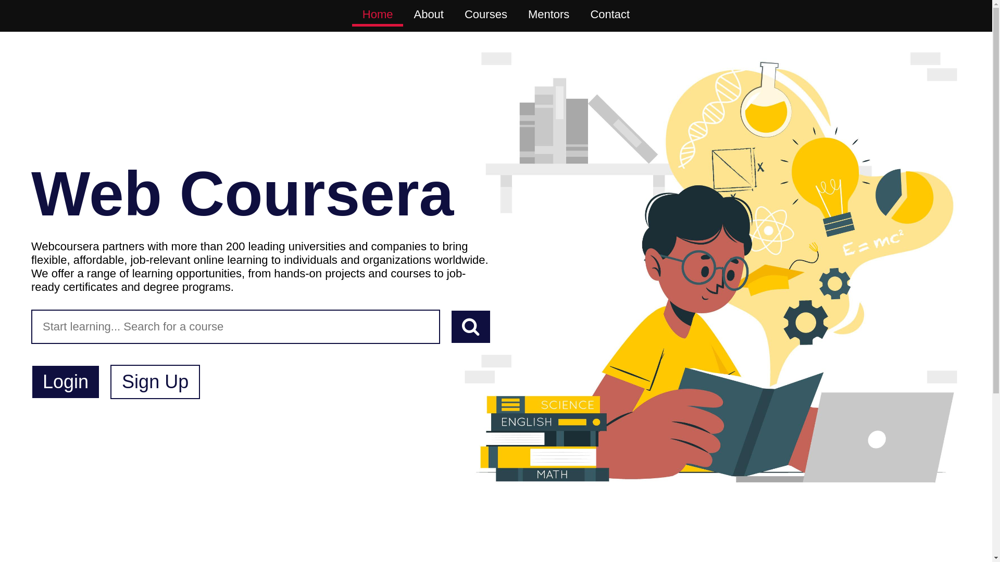
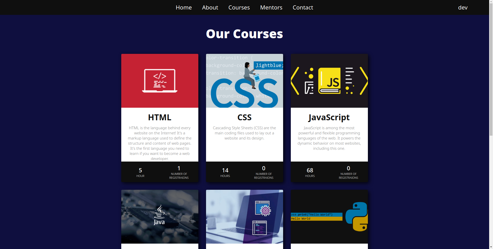
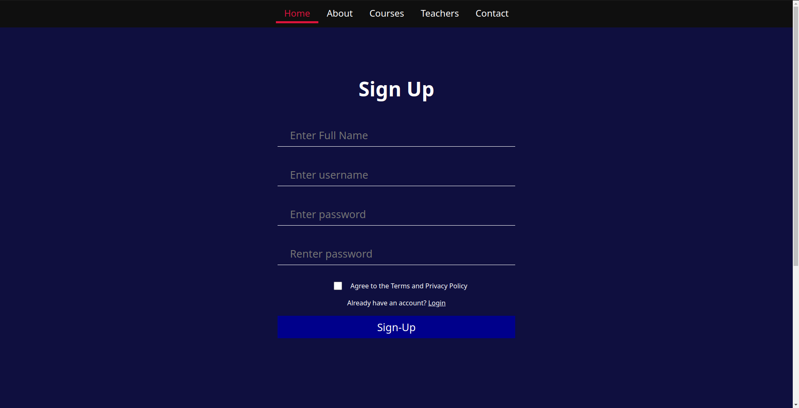
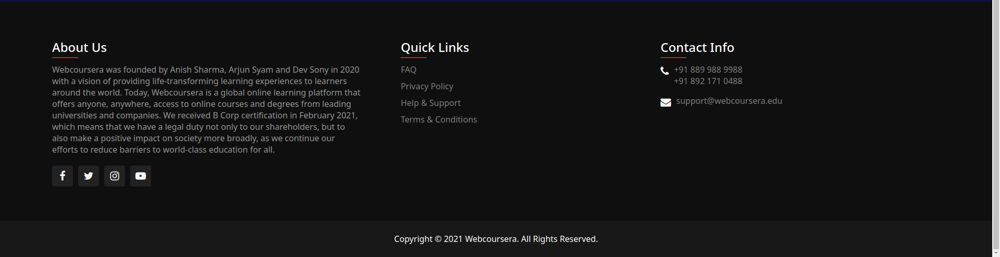

[![Contributors][contributors-shield]][contributors-url]
[![MIT License][license-shield]][license-url]

<!-- PROJECT LOGO -->

  

  <h3 align="center">Web Coursera</h3>

  

    An affordable e-learning website for everyone!
     
    <a href="https://github.com/Hu4k3n/WebP-Project"><strong>Explore the docs »</strong></a>
     
     
    <a href="https://github.com/Hu4k3n/WebP-Project">View Files</a>
    ·
    <a href="https://github.com/Hu4k3n/WebP-Project/issues">Report Bug</a>
    ·
    <a href="https://github.com/Hu4k3n/WebP-Project/issues">Request Feature</a>
  

## About the project

Web coursera is a platform that enables high quality, affordable and flexible learning experiences. Our curated collection of business and technical courses help individuals, companies, governments, and nonprofits go further by placing learning at the center of their strategies. As a global destination for online learning, we strive to connect people through knowledge.

## Objective

To build a courses' website with the given specifications. The course page should list references required for the course including notes, books etc. There should also be recorded sessions of lectures with functionality to categorize and filter videos based on their duration.

## Website Structure

-   Homepage/Landing Page: Serves as an introduction point for new users.
-   Courses Page: An easy to browse courses offered by web coursera.
-   Each Course Page has
    -   A list of references for the course.
    -   Recorded sessions which can be filtered based on duration.
-   Mentors page shows the mentors for the various courses.
-   Footer section provides information about our Mission, Privacy Policy, Terms & Conditions and Contact Details.

## Pages

-   Landing Page
    

-   Courses Page
    

-   HTML Course Page (other Course pages have similar layout)
    

-   Login Page
    

-   Sign-Up Page
    

-   Footer
    

<!-- MARKDOWN LINKS & IMAGES -->
[contributors-shield]: https://img.shields.io/badge/Conitrbutors-3-brightgreen
[contributors-url]: https://github.com/Hu4k3n/WebP-Project/graphs/contributors
[issues-shield]: https://img.shields.io/github/issues/othneildrew/Best-README-Template.svg?style=for-the-badge
[issues-url]: https://github.com/Hu4k3n/WebP-Project/issues
[license-shield]: https://img.shields.io/badge/license-MIT-orange
[license-url]: https://github.com/Hu4k3n/WebP-Project/blob/master/LICENSE.txt
[product-screenshot]: resources/landing-page-ss.png
